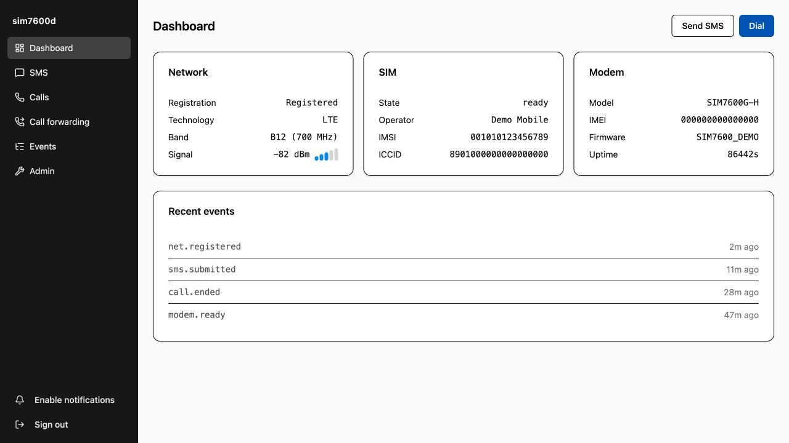

# sim7600d

[](https://github.com/NeverBehave/simcom7600/actions/workflows/build-artifacts.yml)

[English](README.md) | [简体中文](README.zh-CN.md)

`sim7600d` turns a USB-connected SIMCom SIM7600 modem into a small,
self-hosted phone service. A Go daemon owns the modem's AT command port,
persists state in SQLite, exposes an authenticated REST API, and serves a web
interface for SMS, voice calls, and visual voicemail.

The repository also includes a native Android client with the same modem,
messaging, call, forwarding, event, and administrative controls. Its foreground
event connection produces real-time incoming-call and SMS notifications even
when the app UI is not open.



_The dashboard uses synthetic demonstration data. It contains no live phone
numbers, messages, SIM or modem identifiers, credentials, or call records._

## Features

- Send, receive, list, and delete SMS, including GSM-7, UCS-2, and multipart
  messages.
- Dial, answer, reject, and hang up voice calls.
- Read and update carrier voice call-forwarding rules for unconditional, busy,
  unanswered, and unreachable calls.
- Send DTMF during an active call.
- Sync carrier visual voicemail into SQLite, play it in the web or Android app,
  manage heard state, call back, and delete local copies.
- Speak and listen from a browser over an authenticated WebSocket.
- Stream signed 16-bit, mono, 16 kHz PCM through the SIM7600 raw USB audio
  serial interface.
- Track modem status, calls, messages, and events in SQLite.
- Reconcile stored state with the modem after restarts and transport errors.
- Inspect OpenAPI documentation and optional administrator diagnostics.
- Use the native Android app for two-way call audio, notification actions,
  conversational SMS, and all web control-plane functions.

The recommended build embeds the browser UI and API into one Go binary. A
headless server and standalone static web bundle are also produced for split
reverse-proxy deployments. The server listens on `127.0.0.1:8080` by default
and requires one shared bearer token.

## Hardware and audio

The verified deployment uses a SIM7600G-H with USB PID `1e0e:9011`:

- AT commands: the modem AT serial interface, commonly `/dev/ttyUSB3`
- Call audio: the vendor raw audio serial interface, commonly `/dev/ttyUSB4`

SIMCom's "USB AUDIO" interface is not a USB Audio Class or ALSA sound card.
It is a full-duplex raw PCM character device. Before attaching browser audio,
the daemon selects the documented 16 kHz mode with `AT+CPCMFRM=1`, configures
the wideband voice path, and starts PCM transfer with `AT+CPCMREG=1`.

USB interface numbers vary by product ID and firmware. Prefer stable
`/dev/serial/by-id/` paths in production.

## Requirements

- Go 1.26.2 or the version declared by `go.mod`
- Node.js 22 and npm for building the web UI
- JDK 17 and Android SDK 35 for building the APK
- A Linux host with access to the modem AT and raw audio serial devices
- Membership in the device-owning group, commonly `dialout`

## Build and test

```sh
make test
make ui-verify
make build
make artifacts
```

`make build` installs the TypeScript client and UI dependencies, builds the
production UI, embeds it in the daemon, and writes `build/sim7600d`.

`make artifacts` runs the same packaging script used by GitHub Actions and
writes versioned files plus a SHA-256 manifest under `artifacts/`.

## Build artifacts

Every push to `main` runs the
[`Build main artifacts`](.github/workflows/build-artifacts.yml) workflow. The
workflow tests all three codebases and retains four downloadable artifacts for
14 days:

| Artifact | Contents | Intended use |
| --- | --- | --- |
| `sim7600d-server-linux-amd64-<version>.tar.gz` | Linux AMD64 Go server built with the `headless` tag | API/WebSocket server behind a separate static web host |
| `sim7600d-web-<version>.tar.gz` | Production `web/ui/dist` static files | Serve on the same origin as the API, proxying `/v1` and `/openapi.json` to the server |
| `sim7600d-server-web-linux-amd64-<version>.tar.gz` | Linux AMD64 Go server with the web UI embedded | Recommended single-binary deployment |
| `sim7600d-android-<version>.apk` | Installable Android APK | `main` artifacts are debug-signed for testing; tagged releases are privately release-signed |

The server-only build returns HTTP 404 for browser application routes but keeps
the REST API, event stream, and call-audio WebSocket available. Both server
archives contain an executable named `sim7600d`. Each downloadable workflow
artifact includes a matching `.sha256` sidecar; releases additionally include
the combined `SHA256SUMS-<version>.txt` manifest.

The packaging target defaults to Linux AMD64. Override `TARGET_GOOS`,
`TARGET_GOARCH`, `VERSION`, or `ARTIFACT_DIR` when invoking
`scripts/build-artifacts.sh` directly.

## Releases

Pushing a semantic version tag runs the
[`Release`](.github/workflows/release.yml) workflow. It repeats the complete
test and packaging process, creates a GitHub Release with generated notes, and
attaches all four artifacts and their checksum manifest:

```sh
git tag -a v0.2.0 -m "sim7600d v0.2.0"
git push origin v0.2.0
```

Release creation uses the repository-scoped GitHub Actions token with
`contents: write` only in the final publication job; all source checkout,
testing, and packaging run read-only. Ordinary `main` builds are read-only.

Tagged releases require these GitHub Actions secrets. The workflow refuses to
publish a debug-signed APK when any signing value is missing:

- `ANDROID_KEYSTORE_BASE64`: base64-encoded release keystore
- `ANDROID_KEYSTORE_PASSWORD`
- `ANDROID_KEY_ALIAS`
- `ANDROID_KEY_PASSWORD`

### Android app

The Android project is in [`android`](android/README.md). With JDK 17 and the
Android API 35 SDK installed:

```sh
make android-test
make android-build
```

The debug APK is written to
`android/app/build/outputs/apk/debug/app-debug.apk`.

To regenerate the committed OpenAPI document and TypeScript client:

```sh
make openapi
make sdk
make sdk-verify
```

## Configuration

Create a TOML configuration file:

```toml
[server]
bind = "127.0.0.1:8080"
auth_token_file = "/run/secrets/sim7600d-auth-token"

[modem]
tty = "/dev/serial/by-id/usb-SimTech__Incorporated_SimTech__Incorporated_0123456789ABCDEF-if05-port0"
baud = 115200

[audio]
device = "/dev/serial/by-id/usb-SimTech__Incorporated_SimTech__Incorporated_0123456789ABCDEF-if06-port0"

[storage]
path = "/var/lib/sim7600d/sim7600d.db"

[voicemail]
# Opt in to read the carrier mailbox credentials delivered by provisioning SMS.
enabled = false
sync_interval = "5m"

[retention]
events_days = 30
sms_days = 365
calls_days = 365
idem_hours = 24

[admin]
at_passthrough = false
allow_modem_reset = false

[log]
level = "info"
at_trace = false
```

Then start the service:

```sh
./build/sim7600d --config ./sim7600d.toml
```

If neither `SIM7600D_AUTH_TOKEN` nor `auth_token_file` is configured, the
daemon creates an `auth_token` file beside the SQLite database with mode
`0600`. Custom tokens must be at least 32 characters and may contain letters,
digits, `-`, `.`, `_`, and `~`.

Retention values are enforced hourly; `0` keeps that history indefinitely.
Incomplete multipart SMS fragments are removed after seven days regardless of
history retention.

Voicemail mailbox access is disabled by default. When enabled, the daemon reads
the newest supported T-Mobile `MBOXUPDATE` provisioning SMS, connects to that
carrier IMAPS host read-only, and stores playable audio in SQLite. Install
`ffmpeg` in the service PATH so AMR messages can be normalized to WAV. Mailbox
credentials are used in memory and are not written to logs or configuration.

Open the configured address in a browser and enter that token. The OpenAPI
3.1 document is available without authentication at `/openapi.json`; all
modem operations require authentication.

## Security

- Keep the service bound to loopback unless it is protected by a trusted
  reverse proxy or private tunnel.
- Treat the bearer token as a password.
- AT command pass-through and modem reset are disabled unless explicitly
  enabled in configuration.
- The call-audio WebSocket sends its credential as a subprotocol value rather
  than placing it in the URL.

## Development with a remote modem

The Makefile includes helpers for forwarding a remote modem AT port to a local
PTY with SSH and `socat`:

```sh
make bridge-remote
make bridge-tunnel
make bridge-local
make run
```

Override `REMOTE`, `RTTY`, `RPORT`, or `LPTY` as needed. Only one process may
own each physical modem serial interface at a time.

## Verification

Live deployment and hardware results are recorded in
[`docs/verification`](docs/verification/). The verified 16 kHz echo test
covers the complete browser-to-modem-to-cellular-to-browser audio path.

Vendor documentation used by the implementation is catalogued under
[`docs/reference`](docs/reference/simcom/README.md). Proprietary source manuals
and generated full-text extracts stay local and are not redistributed through
this repository.
